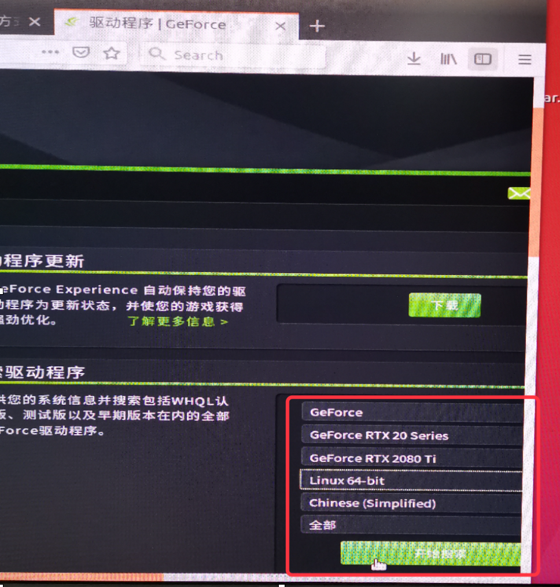

# 1.环境配置

## 1. 安装ubuntu16.04

1.1 用U盘做系统盘

1.2 安装时，注意分区：

​	/swap.   Logical 分区 （电脑内存：16G   分配：32G）

​	/boot。  primary 分区。（600M， 用于存贮日志文件）

​	/。      primary 分区。 （剩余全部）

​	安装系统时，将系统引导安装到/boot下

## 2. 挂载存储超过2T的hard disk（机械硬盘）

参考：https://www.linuxprobe.com/ubuntu-gpt-parted.html

查看已挂载的盘：sudo df -h

查全部盘（修改配置）：fdisk -l

目标修改盘的配置：fdisk /路径

我的机械硬盘的挂载节点通过fdisk -l 查看后为 /dev/sda

////创建挂载节点位置：创建data文件夹：

cd /

sudo -s

mkdir data

开始挂载：

sudo parted /dev/sda #进入parted

mklabel gpt。       #将磁盘格式化为gpt格式

mkpart logical 0 -1。  #讲磁盘的所有容量设置为GPT格式

print。              #查看分区结果

quit                #退出分区状态

partprobe

sudo mkfs.ext4 -F /dev/sda1。  #将刚刚分出来的sda1格式化为ext4格式

sudo gedit /etc/fstab

在文件末尾添加：

/dev/sda1 /home/data ext4 defaults 0 0

保存后退出

sudo mount -a

////重启reboot后查看是否挂载成功：

reboot

sudo df -h

## 3.连接有线网

当网速过慢，导致连接中断：

sudo gedit /etc/ppp/options

\#将其中的lcp-echo-failure 4 修改设置为一个较大的数，例如15

## 4. 安装驱动

下载驱动网址：http://www.geforce.cn/drivers

根据自己的设备查找合适的型号：并下载最新版本。

将下载的 *.run 文件放到 /home/mxx路径下（与Desktop同一路径）

## 5.安装驱动具体过程：

一、禁用系统原始显卡驱动（nouveau）：

1、卸载已安装的驱动（没有安装驱动可跳过）

  \#for case1: original driver installed by apt-get:

sudo apt-get remove --purge nvidia*

 

\#for case2: original driver installed by runfile:

sudo chmod +x *.run

sudo ./NVIDIA-Linux-x86_64-384.59.run --uninstall

2、禁用nouveau驱动

sudo gedit /etc/modprobe.d/blacklist.conf

在最后一行添加：

  blacklist nouveau

然后输入：

  sudo update-initramfs –u

重启电脑

  lsmod | grep nouveau

没有输出，则说明禁用成功

  Ctrl + Alt + F1进入命令行模式

安装显卡驱动，首先进入安装文件位置

sudo chmod +x NVIDIA-Linux-x86_64-390.87.run

  sudo ./NVIDIA-Linux-x86_64-390.87.run

※Ubuntu安装nvidia驱动过程中如果遇到pre-install scipt failed 错误，保证前面的步骤没有错，可以选择继续安装

※如果提示关闭 X server，可以输入以下命令：

sudo /etc/init.d/lightdm stop

重启 X server

sudo /etc/init.d/lightdm status

\###在系统中直接配置深度学习环境（也可跳过这一步，直接进入第二步）

## 6 安装向日葵

直接官网安装

## 7 编译CloudCompare

克隆源码：https://github.com/CloudCompare/CloudCompare.git

选择适合的版本编译安装

cd CloudCompare

mkdir build

cd build

cmake ..

sudo make -j8

sudo make install

若提示error：could not find Qt5Svg

Sudo apt-get install libqt5svg5-dev

但是这样安装的只安装了框架，缺少插件等,也可选择自己编译

用CMake-gui选择需要编译的模块：

A。若提示缺少：dlib

wget http://dlib.net/files/dlib-19.6.tar.bz2

tar xvf dlib-19.6.tar.bz2

cd dlib-19.6/

mkdir build

cd build

cmake ..

cmake --build . --config Release

sudo make install

sudo ldconfig

B。若提示缺少：Cork

git clone https://github.com/gilbo/cork.git

sudo apt-get install clang++-7

sudo apt-get install lld-7

如果报 fatal error: json/json.h: No such file or directory的错，执行下面的命令

sudo apt-get install libjsoncpp-dev 

sudo ln -s /usr/include/jsoncpp/json/ /usr/include/json

最好的方法：到github下载合适的版本，使用CMAKE自己编译

## 8 Ubuntu16.04陷入循环登陆
表现：登陆图形界面分辨率变低，但可以ctrl+Alt+F1可以进入文本模式并可以登陆个人用户。
问题：显卡驱动异常。
解决方案：卸载显卡，重新安装。
参考：https://blog.csdn.net/zw__chen/article/details/79467189
