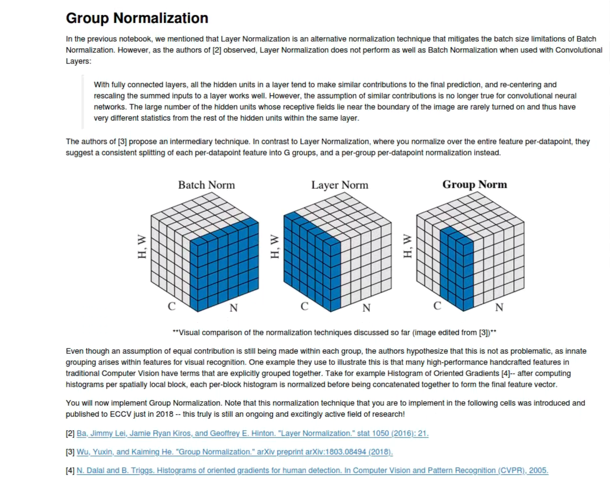

# 2 Layers Fully Connected layer

Loss函数：Loss = L + {正则项}，正则项前还有超参数$\alpha$

​					$Loss = Loss(soft_max) + \alpha*r*(\sum{W_{1}^{2}} +\sum{W_{2}^{2}})$

梯度(权重项有正则项，bias项无正则项)：

​					$Gradient（W_{1}）= dW_{1} + r*W_{1}$

​					$Gradient（W_{2}）= dW_{2} + r*W_{2}$

​					$Gradient（b_{1}）= db_{1}$

​					$Gradient（b_{2}）= db_{2}$

# Normalization：

1. Without Normalization：

2. Batch Normalization：

   Batch normalization with proper batch size makes the network less sensitive to the initial weight scale；But it relies on batch size。However，batch size is hard to select sometimes。

    

3. Layer Normalization：

   Layer normalization is usually applied in Recurrent Neural Networks and it is less sensitive to batch size。

   However， when XX， layer normalization dosen't work very well。

   

4. Instance Normalization：

   

5. Group Normalization：

   

6. Spatial Batch Normalization

   Spatial batch normalization dose normalization per cannel per dimennsion。

   So when we do spatial bacth normalization in convolutional neural network（N，C，H，W），if we expect to use batch normalization forward which expect dimensions of（N‘，D’），treat C as D‘ and N*H*W as N’。

   Just need to order values correctly with transpose。

   

7. 