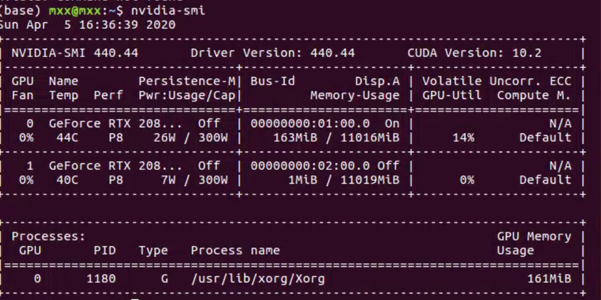

# 1 安装Anaconda

# 2 安装CUDA（需GPU加速模块）
目标：安装CUDA10.1：
下载CUDA10.1

安装时，关闭图形界面，Ctrl+Alt+F1进入字符界面安装（直接在终端安装容易失败）
除了安装显卡驱动的时候选择N，其它全部选择yes
安装后，Ctrl+Alt+F7进入图形界面，在终端中修改环境变量：
sudo gedit ~/.bashrc
在文件末尾添加：
export PATH=/usr/local/cuda-9.0/bin:$PATH
export LD_LIBRARY_PATH=/usr/local/cuda-9.0/lib64:$LD_LIBRARY_PATH
关闭文件

source ~/.bashrc

参考：https://blog.csdn.net/oTengYue/article/details/79506758

安装CUDA完成后，安装的路径为：/usr/local/cuda，版本为：10.1.243

查看所安装的CUDA的版本的方法：cat /usr/local/cuda/version.txt


# 3 安装cuDNN （需GPU加速模块）
目标：安装cuDNN for CUDA 10.1，适配CUDA10.1
下载：cuDNN [Link]{https://developer.nvidia.com/rdp/cudnn-download}
cuDNN Library for Linux (.tar文件)

tar -zxvf xxxxx.tar
cd cuda
cd include
sudo cp cudnn.h /usr/local/cuda/include  #复制头文件

cd ..
cd lib64
sudo cp lib* /usr/local/cuda/lib64/    #复制动态链接库
cd /usr/local/cuda/lib64/
sudo chmod +r libcudnn.so.7.6.5
sudo ln -sf libcudnn.so.7.6.5 libcudnn.so.7
sudo ln -sf libcudnn.so.7 libcudnn.so
sudo ldconfig
————————————————
原文链接：https://blog.csdn.net/oTengYue/article/details/79506758

已安装成功的CUDNN的位置：/usr/local/cuda/include/cudnn.h, 版本为：7.6.5

查看CUDNN版本的方法：

cat /usr/local/cuda/include/cudnn.h | grep CUDA_MAJOR -A 2


# 4 NVCC

以上CUDA与CUDNN安装后，用以上查看版本方法可以查到相应版本，但是使用

nvcc --version 查询是，显示nvcc还未安装。

通过：

sudo apt install nvidia-cuda-toolkit

再次，使用nvcc --version,显示版本为：v7.5.17


# 5 NCCL

于nvidia官网下载与cuda版本一致的nccl

https://developer.nvidia.com/nccl/nccl-download

local版本：

sudo dpkg -i xxx.deb

sudo apt update

sudo apt install libnccl2=2.6.4-1+cuda10.1 libnccl-dev=2.6.4-1+cuda10.1


# 6 显卡驱动 失效

症状：nvidia-smi 命令后，显示nvidia driver not found error之类

解决方案：关闭图像界面，重新安装显卡驱动。

参考：http://www.manongjc.com/article/80680.html

```
sudo service lightdm stop
sudo ./NVIDIA-Linux-x86_64-440.44.run -no-x-check -no-nouveau-check -no-opengl-files
sudo service lightdm restart
```

安装成功后显示：


# 6 创建项目环境

## 4.1 Detectorn2

## 4.2 TensorFlow
