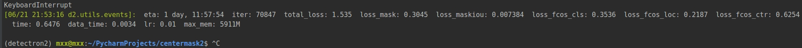

centermask按照detectron2的安装要求安装好后，训练：

2个GPU训练命令：

```
python train_net.py --config-file "configs/centermask/centermask_V_57_eSE_FPN_ms_3x.yaml" --num-gpus 2 MODEL.WEIGHTS "model-param/vovnet57_ese_detectron2.pth"
# 使用预训练模型vovnet57训练该模型
# BUG1: 修改原始模型配置文件.yaml中的batch size，从16修改到4，才避免了cuda内存错误的问题
```

1个GPU训练命令

```
CUDA_VISIBLE_DEVICE=1 python train_net.py --config-file "configs/centermask/centermask_V_57_eSE_FPN_ms_3x.yaml" --num-gpus 1 MODEL.WEIGHTS "model-param/vovnet57_ese_detectron2.pth"
# 使用1块显卡训练时，总是出现CUDA内存不够错误
```


训练结果：

迭代7000多次后，总的loss为1.535，最后一直在这个值上下浮动，遂停止。



