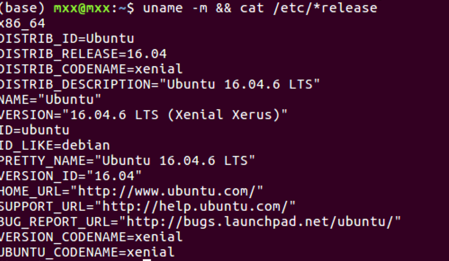
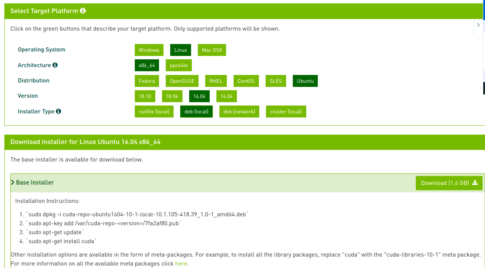
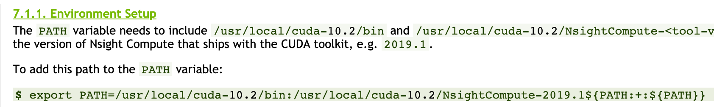
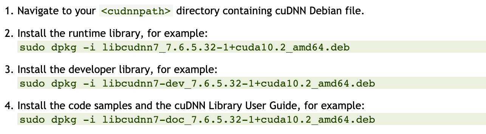
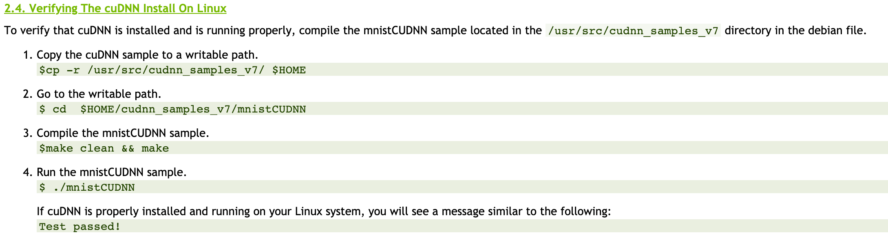

# ！！写在前面：出现问题时，不要随便删除文件！！！


# 1 安装Anaconda

创建环境：conda create -n name python=3.x

删除环境：conda remove -n name --all

激活环境：conda activate name

退出环境：conda deactivate

#### BUG-1: conda create -n py37 python=3.7

如果想在创建环境的时候，同时制定python版本及其他库，则报错：

PackagesNotFoundError: The following packages are not available from current channels

原因：下载库的源被删除？？（不知道为什么）

解决方法：

```
conda config --add channels https://conda.anaconda.org/conda-forge # 添加下载源
conda config --show #显示conda环境

# if 要删除下载源：
conda config --remove channels https://conda.anaconda.org/conda-forge
```


# 2 安装CUDA（需GPU加速模块）

目标：安装CUDA10.1：
下载CUDA10.1

安装时，关闭图形界面，Ctrl+Alt+F1进入字符界面安装（直接在终端安装容易失败）
除了安装显卡驱动的时候选择N，其它全部选择yes
安装后，Ctrl+Alt+F7进入图形界面，在终端中修改环境变量：
sudo gedit ~/.bashrc
在文件末尾添加：
export PATH=/usr/local/cuda-10.1/bin:$PATH

export LD_LIBRARY_PATH=/usr/local/cuda-10.1/lib64:$LD_LIBRARY_PATH
关闭文件

source ~/.bashrc

参考：https://blog.csdn.net/oTengYue/article/details/79506758

安装CUDA完成后，安装的路径为：/usr/local/cuda，版本为：10.1.243

查看所安装的CUDA的版本的方法：cat /usr/local/cuda/version.txt

**测试CUDA是否安装成功：**

<font color=red>参考：linux安装GPU显卡驱动、CUDA和cuDNN库</font>

https://blog.csdn.net/oTengYue/article/details/79506758


cudatookit安装

1 查看系统中是否有支持cuda的GPU

​	`lspci | grep -i nvidia`

2 查看linux内核信息

`uname -m && cat /etc/*release`



3 查看是否下载gcc

'gcc --version'

如果没有，则需要下载gcc

4 [2.4. Verify the System has the Correct Kernel Headers and Development Packages Installed](https://docs.nvidia.com/cuda/cuda-installation-guide-linux/index.html#verify-kernel-packages)

检测系统内核版本

`uname -r`

输出：4.15.0-101-generic

<font color=red>注意：如果更新了系统内核（update），则需要运行以下以保证内核头文件和package，否则cuda将失效</font>

`udo apt-get install linux-headers-$(uname -r)`

5 下载对应的cuda版本（.deb）

https://developer.nvidia.com/cuda-10.1-download-archive-base?target_os=Linux&target_arch=x86_64&target_distro=Ubuntu&target_version=1604



6 CUDA 安装

如上图的四个命令

7 后处理（设置环境变量）

https://docs.nvidia.com/cuda/cuda-installation-guide-linux/index.html#post-installation-actions



8 测试


# 3 安装cuDNN （需GPU加速模块）

目标：安装cuDNN for CUDA 10.1，适配CUDA10.1
下载：cuDNN [Link]{https://developer.nvidia.com/rdp/cudnn-download}

步骤参考：https://docs.nvidia.com/deeplearning/sdk/cudnn-install/index.html

cuDNN Library for Linux (.tar文件)

```
$ tar -xzvf cudnn-10.1-linux-x64-v7.5.1.32.tgz
$ sudo cp cuda/include/cudnn.h /usr/local/cuda/include
$ sudo cp cuda/lib64/libcudnn* /usr/local/cuda/lib64
$ sudo chmod a+r /usr/local/cuda/include/cudnn.h /usr/local/cuda/lib64/libcudnn*
```

已安装成功的CUDNN的位置：/usr/local/cuda/include/cudnn.h, 版本为：7.5.1

查看CUDNN版本的方法：

cat /usr/local/cuda/include/cudnn.h | grep CUDA_MAJOR -A 2

检测cudnn是否安装成功：

检测后无法通过测试例子；故卸载cudnn7.6.5，重新安装7.5.1版本





注：若make时报错，则使用sudo make

# 4 NVCC

以上CUDA与CUDNN安装后，用以上查看版本方法可以查到相应版本，但是使用

nvcc --version 查询是，显示nvcc还未安装。

通过：

sudo apt install nvidia-cuda-toolkit

再次，使用nvcc --version,显示版本为：v7.5.17

但是此时显示的cuda版本为7.5，与我们安装的10.1的版本不匹配。

解决方案：

cd /usr/local/cuda/bin

查看此文件夹下是否有nvcc文件，如果没有，则cuda安装失败，需重新安装cuda；如果有nvcc，则进行一下操作：

sudo gedit ~/.bashrc

在文件末尾添加（此时在写cuda路径时，一定注意usr前面的斜杠/，之前有次因为疏忽，导致错误）：

export PATH=$PATH:/usr/local/cuda/bin

保存后退出

source ～/.bashrc

exit

退出终端后重新打开终端，输入：nvcc --version

显示正确的cuda版本为10.1

参考：https://blog.csdn.net/rtygbwwwerr/article/details/73656876 

# 5 NCCL

于nvidia官网下载与cuda版本一致的nccl

https://developer.nvidia.com/nccl/nccl-download

local版本：

sudo dpkg -i xxx.deb

sudo apt update

sudo apt install libnccl2=2.6.4-1+cuda10.1 libnccl-dev=2.6.4-1+cuda10.1

NCCL：建议安装方法（谨慎使用apt update）：

https://blog.csdn.net/Jkwwwwwwwwww/article/details/81135327?utm_medium=distribute.pc_relevant.none-task-blog-BlogCommendFromMachineLearnPai2-2.nonecase&depth_1-utm_source=distribute.pc_relevant.none-task-blog-BlogCommendFromMachineLearnPai2-2.nonecase

https://blog.csdn.net/lwplwf/article/details/82788818


# 6 显卡驱动 失效

症状：nvidia-smi 命令后，显示nvidia driver not found error之类

解决方案：关闭图像界面，重新安装显卡驱动。

参考：http://www.manongjc.com/article/80680.html

```
sudo service lightdm stop
sudo apt-get remove --purge nvidia-*
sudo ./NVIDIA-Linux-x86_64-440.44.run -no-x-check -no-nouveau-check -no-opengl-files
sudo service lightdm restart
```

安装成功后显示：


## 7 nvcc --version 与cat /usr/local/cuda/version.txt版本不同

**原因：**

机器上装了多个版本的CUDA，使用nvcc --verison查看得到的是PATH中的CUDA，而cat查看的是version.txt所在文件夹中安装的CUDA。

可以使用which nvcc查看调用的是哪里的nvcc, 然后用/usr/local/cuda/bin/nvcc看看是不是不一样（一样即可）。

**解决方法：**

把想用的CUDA的bin目录配置`PATH`中：

编辑`~/.bashrc`，在最后加入：`export PATH=/usr/local/cuda/bin:$PATH`。

然后：保存，关闭文件。

执行：source ～/.bashrc

————————————————
参考【1】：https://blog.csdn.net/xpy870663266/java/article/details/103235073

## 8 为何`nvidia-smi` 中的CUDA 版本与 `nvcc`不一致：

**需要保持nvcc中的cuda版本与nvidia-smi中一致：**

nvidia-smi显示的是你安装的NVIDIA驱动的版本号，而不是CUDA 的版本号，意思是当你安装多个CUDA时，你的系统应该只有一个显卡驱动，nvidia-smi 显示的是你的驱动的版本号，而nvcc显示的是你的环境变量相对应的CUDA的版本号

参考【2】：https://blog.csdn.net/ljp1919/article/details/102640512

## 9 显卡驱动崩溃，循环登陆

https://www.tfzx.net/index.php/article/2805365.html

# 6 创建项目环境

## 4.1 Detectorn2

## 4.2 TensorFlow

