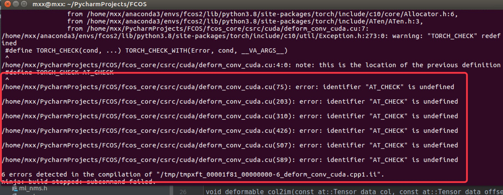

系统：Ubuntu16.04

Cuda-10.1 + cudnn-7.5.1

anaconda环境下安装：

按照FCOSgit仓库中的intsall.md步骤配置环境后，编译时，出现如下错误：

#### 1 "AT_CHECK" is undefined.



解决方法：

在所有报此错误的.cu文件里添加宏定义，将AT_CHECK由TORCH_CHECK代替：

```
#define AT_CHECK TORCH_CHECK
```

#### 2 缺失opencv-python 或cv2

```
pip install opencv-python
```

#### 3 无法加载这些基础模块：matplotlib等

解决方法：先卸载，再下载

```
pip uninstall matplotlib
pip install matplotlib
```

#### 4 跑demo/fcos_demo.pys时，报错：

 cv2.putText(
TypeError: only integer tensors of a single element can be converted to an index

解决方法:在cv2.putText中的第三个参数（x，y）改为（int(x), int(y)）

```
cv2.putText(
    image, s, (int(x), int(y)), cv2.FONT_HERSHEY_SIMPLEX, .5, (255, 255, 255), 1
)
```

#### 5 单GPU测试命令：

python tools/test_net.py     --config-file configs/fcos/fcos_imprv_R_50_FPN_1x.yaml     MODEL.WEIGHT FCOS_imprv_R_50_FPN_1x.pth     TEST.IMS_PER_BATCH 4 

#### 6 多GPU测试命令（两块卡）：

python -m torch.distributed.launch     --nproc_per_node=2     --master_port=$((RANDOM + 10000))     tools/test_net.py     --config-file configs/fcos/fcos_imprv_R_50_FPN_1x.yaml     MODEL.WEIGHT FCOS_imprv_R_50_FPN_1x.pth     TEST.IMS_PER_BATCH 4

#### 7 多GPU训练（两块卡）：

##### 命令：

python -m torch.distributed.launch     --nproc_per_node=2     --master_port=$((RANDOM + 10000))     tools/train_net.py     --config-file configs/fcos/fcos_imprv_R_50_FPN_1x.yaml     DATALOADER.NUM_WORKERS 2 OUTPUT_DIR training_dir/fcos_imprv_R_50_FPN_1x


###### 错误1：

RuntimeError: CUDA out of memory. Tried to allocate 20.00 MiB (GPU 0; 10.76 GiB total capacity; 9.70 GiB already allocated; 9.50 MiB free; 9.78 GiB reserved in total by PyTorch)

错误1-解决方案：

1. 通过kill PID 杀死卡死的进程
2. 修改configs/fcos/fcos_imprv_R_50_FPN_1x.yaml中SOLVER.IMS_PER_BATCH：由16修改为8 （batch size适用于原来的多GPU训练）
3. 再次运行命令，并通过watch -n 0.1 nvidia-smi 监视GPU的使用情况。
4. 训练正常进行时，两块GPU的利用率均达到90%+

意外1：

不小心在正在输出训练log的终端窗口中按下了：Ctrl+S，导致停止输出。

解决方案：在终端输入Ctrl+Q，恢复终端打印输出。


8 用自己的数据集测试

（1）error：bndbx的维度错误：

​		原因：

（2）修改类别后的一系错误：81类变15类


