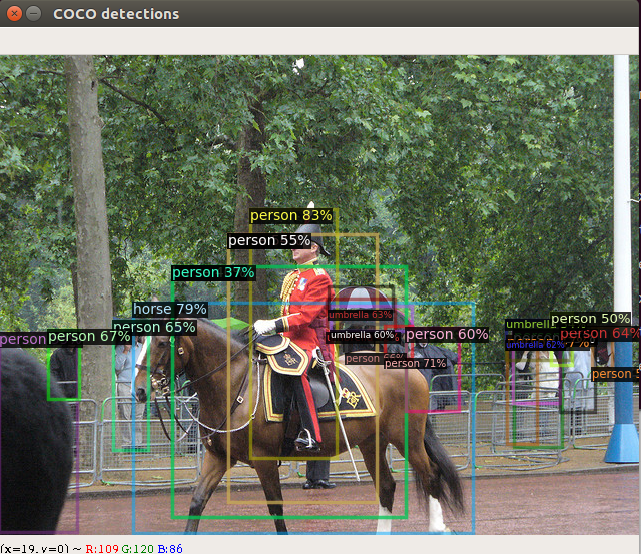

# 搭建AdelaiDet的环境

1 按照https://github.com/aim-uofa/AdelaiDet 中ReadMe.md中的要求先搭建detectron2的环境；

2 clone AdelaiDet工程，并编译；

```
# 与detectron2 同级目录
git clone https://github.com/aim-uofa/AdelaiDet.git

# 编译 AdelaiDet
cd AdelaiDet
python setup.py build develop

# 一般detectron编译成功后，在detectron2的虚拟环境下编译AdelaiDet，基本也没有Bug出现
```

3 Quick Start

使用预训练模型

```
# 1 选择一个模型，比如：fcos_R_50_1x.yaml
# TODO：弄清楚，R，50，1x的含义

# 2 下载模型
mkdir pretrain-model
cd pretrain-model
wget https://cloudstor.aarnet.edu.au/plus/s/glqFc13cCoEyHYy/download -O fcos_R_50_1x.pth

# 3 run demo
python demo/demo.py \
    --config-file configs/FCOS-Detection/R_50_1x.yaml \
    --input /home/mxx/Data/test_input.jpg \
    --opts MODEL.WEIGHTS pretrain-model/fcos_R_50_1x.pth
```

​		FCOS目标检测结果如下图所示：

​	

